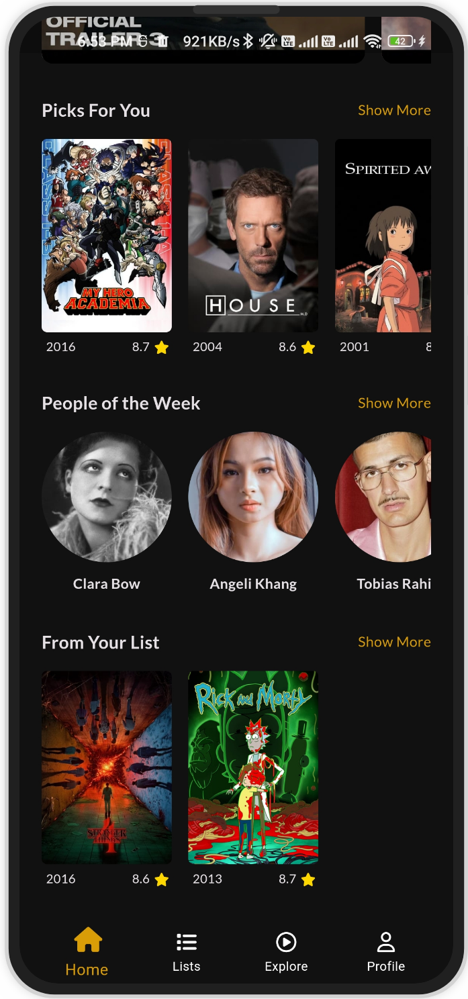

  
  <h1>Spark</h1>
  
Spark - An IMDB redesign with the ability to display shows

  

## Table of Contents

- [Introduction 🏛️](#introduction-🏛️)
- [Demo 🚀](#demo-🚀)
- [Features 🌟](#features-🌟)
- [Screenshots 📸](#screenshots-📸)
- [Packages Used 📚](#packages-used-📚)
- [Author](#team-section)

  

## Introduction 🏛️

Welcome to Spark, your one-stop destination for exploring the world of movies, TV shows, and celebrities. Spark is a redesigned platform inspired by IMDb, powered by The Movie Database (TMDb) API. With Spark, you can seamlessly discover, explore, watch, and enjoy a vast collection of cinematic content, all at your fingertips.

  

## Demo 🚀

  

## Features 🌟

- 14+ Screens
- Responsive UI
- GetX
- Clean Architecture
- MVC design pattern
- Error Handling
- TMDB API Integration
- Light & Dark Theme
- WebView
- Firebase Auth
- Firebase Firestore
- VidSrc API
- Pagination

  

## Screenshots 📸

<table>
  <tbody>
    <tr>
      <td align="center"></td>
      <td align="center"></td>
      <td align="center"></td>
    </tr>
    <tr>
      <td align="center"></td>
      <td align="center"></td>
      <td align="center"></td>
    </tr>
    <tr>
      <td align="center"></td>
      <td align="center"></td>
      <td align="center"></td>
    </tr>
    <tr>
      <td align="center"></td>
      <td align="center"></td>
      <td align="center"></td>
    </tr>
    <tr>
      <td align="center"></td>
      <td align="center"></td>
      <td align="center"></td>
    </tr>
    <tr>
      <td align="center"></td>
      <td align="center"></td>
      <td align="center"></td>
    </tr>
    <tr>
      <td align="center"></td>
      <td align="center"></td>
      <td align="center"></td>
    </tr>
    <tr>
      <td align="center"></td>
      <td align="center"></td>
      <td align="center"></td>
    </tr>
    <tr>
      <td align="center"></td>
    </tr>
  </tbody>
</table>

  

## Packages Used 📚

The app utilizes several packages to enhance its functionality. Some of the key packages used include:

- build_runner
- cached_network_image
- cloud_firestore
- cupertino_icons
- dartz
- dio
- expandable_text
- firebase_auth
- firebase_core
- flutter_dotenv
- flutter_facebook_auth
- flutter_svg
- font_awesome_flutter
- freezed
- freezed_annotation
- get
- google_sign_in
- intl
- json_annotation
- lottie
- persistent_bottom_nav_bar
- photo_view
- shared_preferences
- shimmer
- uuid
- webview_flutter
- youtube_player_flutter
- flutter_launcher_icons

These packages are crucial for enabling various functionalities and enhancing the app's capabilities.

  

  <h1 align="center">Meet the Visionary Mind Behind the Project 🌟</h1>

  <table align = "center">
    <tr>
      <td align="center"><a href="https://github.com/mina329"></td>
    </tr>
  </table>

  <h2>About Me:</h2>
  <ul>
    <li><strong>Name:</strong> Mina Emil</li>
    <li><strong>Role:</strong> Flutter Developer</li>
    <li><strong>Passion:</strong> Crafting applications that seamlessly blend functionality and aesthetics.</li>
  </ul>

  <h2>Connect with Me:</h2>
  
Feel free to reach out if you have any questions, suggestions, or just want to say hello! You can contact me at
    <a href="mailto:mina.emil.fakhry@outlook.com">mina.emil.fakhry@outlook.com</a>.

  <h2>LinkedIn:</h2>
  

  
Thank you for choosing Tamam. Let's make task management a delightful and efficient experience together!

  

